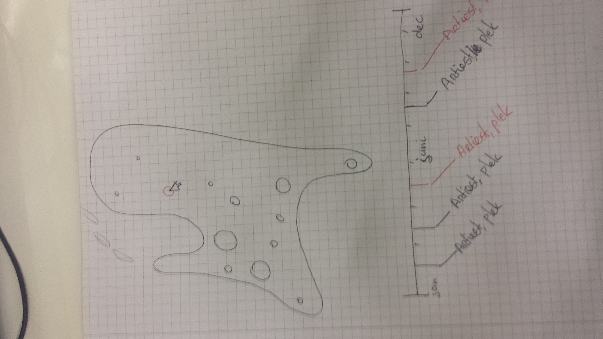
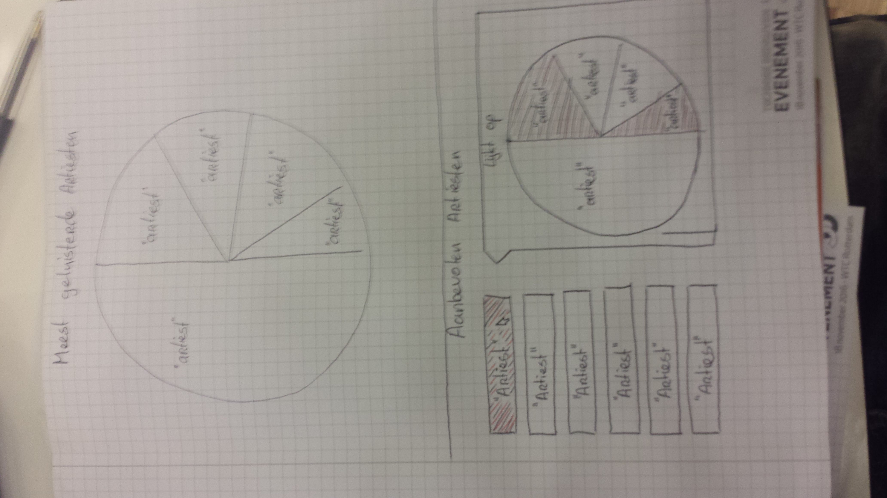

# Programmeerproject
## Spotify - Your Taste
Een web applicatie waarbij je in kunt loggen met je spotify-account.
De applicatie kijkt naar je artiesten en afspeellijsten en visualizeert waar je het meest naar luistert, op basis van:
* artiesten
* genres
* albums
* nummers

###### Ik weet niet of de spotify API een afspeelcount kan geven.

Daarnaast kun je een visualisatie oproepen die bands weergeeft die lijken op de muziek die je al hebt. Bands die veel bij je passen worden prominenter weergegeven.

Een datamap met bubbels van bijvoorbeeld nederland waar, samen met een tijdlijn weergegeven wordt welke bands die je leuk vind in de buurt een concert geven.

Het zou mooi zijn om het met CSS een beetje op spotify zelf te laten lijken.

Als het niet mogelijk is om op te vragen hoevaak een track of artiest beluisterd is door de user, dan kun je nog altijd kijken naar hoeveel artiesten de user van een bepaald genre heeft en op die manier een pie-chart maken.

### Concept uitgetekend

